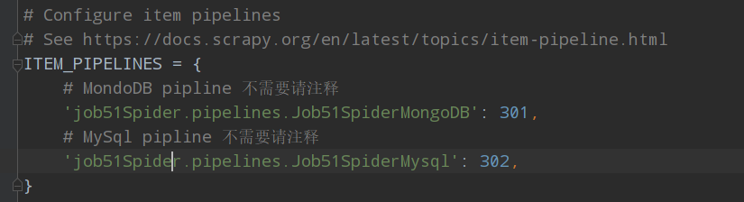
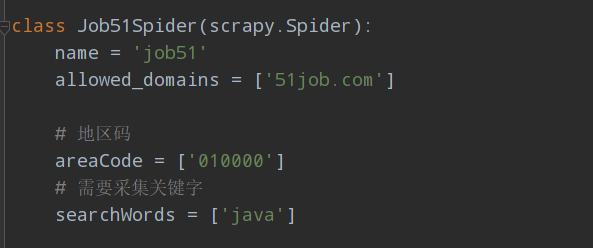

### 安装准备

环境需求：python3.6+

安装scrapy

```shell
pip3 install scrapy
```

安装pymysql

```shell
pip3 install pymysql
```

安装mongodb

```shell
pip3 install mongodb
```

### 配置数据库参数

进入文件夹job51Spider

找到settings.py文件，拉到最后配置mysql和mongodb信息

通过注释和取消注释ITEM_PIPELINES里的相关信息可实现开启mysql和mongodb的存储方式



**默认为全部关闭**


如果使用的是mysql数据库，请执行使用以下sql语句创建数据表

```mysql
CREATE TABLE `job51` (
  `id` int(11) NOT NULL AUTO_INCREMENT COMMENT 'id',
  `jobName` varchar(50) DEFAULT NULL COMMENT '职位名称',
  `salary` varchar(32) DEFAULT NULL COMMENT '薪资',
  `needWorkExperience` varchar(32) DEFAULT NULL COMMENT '工作经验',
  `education` varchar(32) DEFAULT NULL COMMENT '学历',
  `companyAdder` varchar(32) DEFAULT NULL COMMENT '公司地址',
  `description` text COMMENT '职位描述',
  `jobRequire` text COMMENT '任职要求',
  `companyType` varchar(32) DEFAULT NULL COMMENT '公司所属行业',
  `employeeNum` varchar(32) DEFAULT NULL COMMENT '公司人数',
  `jobUrl` varchar(100) DEFAULT NULL COMMENT '职位链接',
  PRIMARY KEY (`id`)
) ENGINE=InnoDB AUTO_INCREMENT=95 DEFAULT CHARSET=utf8mb4
```

注意表名要和settings.py文件里面的相对应，这里默认是`job51`


### 自定义地区和搜索词

打开爬虫文件`job51.py`

找到以下部分



地区码参考链接：

https://search.51job.com/list/010000,000000,0000,00,9,99,java,2,1.html

010000位置为地区码

如果需要爬取多个地区，请用列表的方式填入

设置多个搜索关键字方法同上


### 运行爬虫

```shell
cd job51Spider

scrapy crawl job51
```


### 提示

以上各功能均已测试没有问题

mongodb和mysql的存储也正常